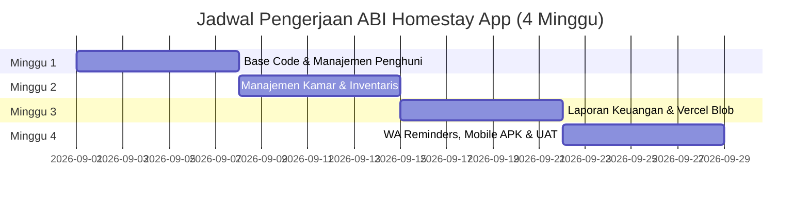

# Rincian Biaya Hosting, Environment Development & Fitur Pengembangan App ABI Homestay

> **Dokumen Penawaran & Spesifikasi Layanan App ABI Homestay**  
> *Sistem Pengelolaan Homestay / Kost: Manajemen Kamar, Penghuni, Keuangan, dan Mobilisasi Mobile App.*

---

## 1. Yang Sudah Jalan Sekarang (Status Saat Ini)

Sistem telah dikembangkan dan siap berjalan dengan infrastruktur modern berikut:

| Komponen | Alamat / Platform | Status |
| :--- | :--- | :--- |
| **Aplikasi Web (Admin & Staff)** | `abi-homestay-app.vercel.app` (Vercel Next.js 16) | Jalan |
| **Database Server** | MongoDB Atlas Cluster (`abi-homestay`) | Jalan |
| **Storage Bukti Bayar / Media** | Vercel Blob Storage (`receipts/`) | Jalan |
| **Mobile App Native** | Android APK (Capacitor Webview) & iOS Ready | Siap Deploy |

### Lisensi Domain:
- Domain `abihomestay.com` (atau subdomain `app.abihomestay.com`) dapat dihubungkan langsung ke Vercel tanpa biaya tambahan dari platform Vercel.
- **Biaya Perpanjangan Domain**: ± **Rp 180.000 / tahun** (termasuk DNS Management & SSL gratis bawaan Vercel).

---

## 2. Biaya Hosting Production (Bulanan)

Ditagihkan bulanan berdasarkan estimasi pemakaian normal aplikasi homestay.

| Komponen | Layanan & Spesifikasi | Biaya / Bulan |
| :--- | :--- | :--- |
| **Hosting Aplikasi Web & API** | Vercel Hosting (Next.js Serverless & Server Actions) | Rp 0 (Free Tier) / Rp 50.000 |
| **Database Server** | MongoDB Atlas (Cluster Shared / Dedicated M0/M2) | Rp 25.000 |
| **Storage Bukti Bayar** | Vercel Blob Storage (Penyimpanan foto & struk transfer) | Rp 15.000 |
| **Pengiriman WhatsApp Notification** | WA API Gateway / Direct Web Link (`wa.me`) | Rp 0 |
| **DNS & SSL Certificate** | Vercel / Cloudflare DNS Management + Automatic HTTPS | Rp 0 |
| **Total Hosting Production** | **Estimasi pemakaian bulanan** | **Rp 75.000 – Rp 90.000 / bulan** |

---

## 3. Tambahan: Environment Development (Opsional)

Untuk memastikan pengembangan fitur baru tidak mengganggu data transaksi asli dan operasional homestay yang sedang berjalan, dapat disediakan lingkungan *Development* (Staging) terpisah:

| Website Development | Alamat / Server |
| :--- | :--- |
| **Aplikasi Web Staging** | `dev-abi-homestay.vercel.app` |
| **Database Staging** | MongoDB Atlas Cluster Terpisah (`abi-homestay-dev`) |
| **Storage Staging** | Vercel Blob Bucket Terpisah |

### Rincian Biaya Environment Development:
- **Biaya Bulanan Staging**: **Rp 75.000 / bulan** *(Opsional, hanya dibutuhkan selama masa pengembangan fitur baru dan bisa dimatikan setelah serah terima)*.

---

## 4. Ringkasan Biaya Bulanan (Hosting)

| Pilihan | Detail Layanan | Biaya / Bulan |
| :--- | :--- | :--- |
| **Hosting Production Saja** | Sistem utama operasional berjalan penuh | **Rp 90.000** |
| **Production + Environment Dev** | Sistem utama + staging terpisah untuk uji coba | **Rp 165.000** |

---

## 5. Biaya Development & Peningkatan Fitur (Phase 2)

Perhitungan estimasi biaya pengembangan dirinci berdasarkan bobot hari-orang (*man-days*) developer:

| No | Fitur & Modul Pengembangan | Hari | Biaya |
| :-: | :--- | :-: | :-: |
| **1** | **Import & Export Excel/CSV Data Penghuni** *(Parser SheetJS, auto-sanitasi HP, validasi kamar, auto-close modal & refresh)* | 2,0 | Rp 100.000 |
| **2** | **Optimasi Kueri Batch Database & Fix Timeout** *(Deduplikasi kamar & upsert paralel MongoDB Atlas)* | 1,5 | Rp 75.000 |
| **3** | **Manajemen Kamar & Status Multi-Kondisi** *(Available, Occupied, Maintenance & checklist inventaris kamar)* | 2,5 | Rp 125.000 |
| **4** | **Sistem Notifikasi Auto-WhatsApp Reminders** *(Pesan otomatis tagihan sewa & tanggal jatuh tempo)* | 3,0 | Rp 150.000 |
| **5** | **Modul Laporan Keuangan & Upload Struk Transfer** *(Integrasi Vercel Blob Storage & filter transaksi)* | 3,5 | Rp 175.000 |
| **6** | **Pencetakan & Export Laporan PDF / Excel** *(Ringkasan pemasukan, pengeluaran & tunggakan)* | 2,5 | Rp 125.000 |
| **7** | **Sistem Hak Akses Multi-Role (ADMIN, EDIT, VIEW)** *(Security cookie session, proteksi Server Action & UI)* | 2,0 | Rp 100.000 |
| **8** | **Sinkronisasi APK Android (Capacitor) & Webview Build** *(Integrasi kamera, splashscreen & ikon app)* | 2,0 | Rp 100.000 |
| **9** | **Dashboard Analytics & Chart Okupansi** *(Grafik tingkat keterisian kamar & estimasi omset)* | 2,5 | Rp 125.000 |
| **10** | **Halaman Pengaturan Master Pricing & Aplikasi** *(Ubah harga harian, mingguan, bulanan, tahunan)* | 1,5 | Rp 75.000 |
| **Subtotal Fitur** | **23,0 Hari** | **Rp 1.150.000** |
| **11** | **Testing Internal & UAT Bersama Admin/Owner** | 4,0 | Rp 200.000 |
| **Total Development** | **Total Keseluruhan** | **27,0 Hari** | **Rp 1.350.000** |

---

## 6. Jadwal Pengerjaan (Timeline 4 Minggu)

| Periode | Fokus Pengerjaan | Detail Fitur | Hasil Akhir Periode |
| :--- | :--- | :--- | :--- |
| **Minggu 1** | **Core Data & Penghuni** | Impor-Ekspor Excel/CSV, sanitasi nomor HP +62, modul penghuni, optimasi MongoDB | Sistem dapat mengimpor data penghuni massal secara instan |
| **Minggu 2** | **Manajemen Kamar** | Status Available/Occupied/Maintenance, checklist inventaris barang kamar | Kamar terintegrasi penuh dengan data penghuni |
| **Minggu 3** | **Keuangan & Storage** | Transaksi pemasukan/pengeluaran, upload struk Vercel Blob, laporan PDF/Excel | Laporan keuangan dapat diunduh dan dicetak |
| **Minggu 4** | **Fitur Lanjutan & Mobile** | WA Reminders, Multi-Role Access (Admin/Edit/View), Build Android APK, Testing & UAT | Aplikasi siap dipakai di Web & Smartphone Android |

---

## 7. Catatan Harga & Syarat Ketentuan

1. **Mata Uang**: Seluruh harga dicantumkan dalam **Rupiah (IDR)**.
2. **Kapasitas Database & Storage**: Biaya hosting dihitung berdasarkan pemakaian operasional normal homestay (hingga 100 kamar & ribuan transaksi).
3. **Domain & Lisensi**: Pembelian domain (`.com` / `.id`) merupakan biaya tahunan terpisah dari registrar domain.
4. **Perubahan Lingkup**: Permintaan penambahan fitur di luar 10 modul utama yang dirinci di atas akan dihitung sebagai penambahan *scope* baru.
